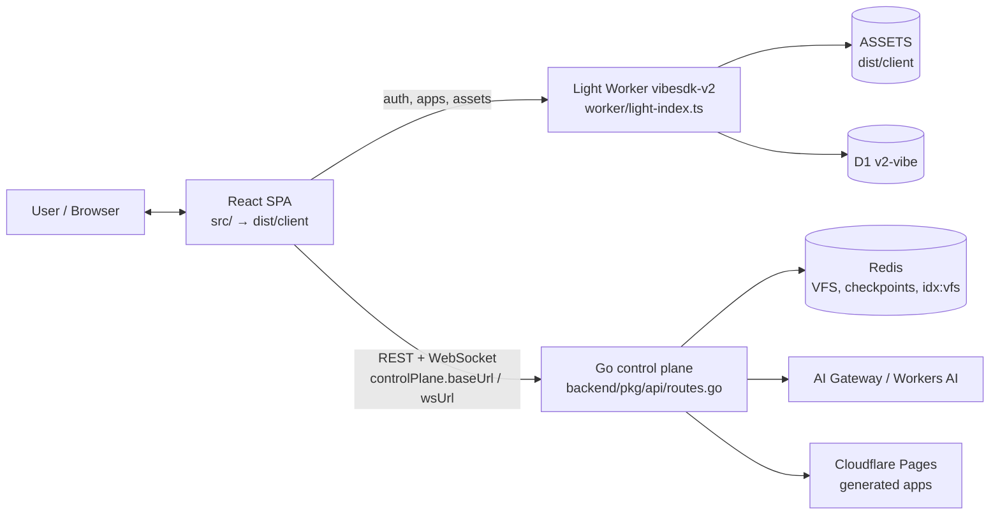

# Cloudflare VibeSDK

> An open source, agentic platform for building and deploying full-stack applications on Cloudflare.

<div align="center">

[](https://deploy.workers.cloudflare.com/?url=https://github.com/cloudflare/vibesdk)

</div>

## What is VibeSDK?

VibeSDK lets people build full-stack applications by working with an AI coding agent. Describe what you want, answer clarifying questions, and follow the agent as it plans, edits files, deploys previews, inspects errors, and iterates with you in the loop.

The platform runs as a **dual-plane** system:

- A **Go control plane** (`backend/`) owns agent sessions, code generation, project and VFS state, and Cloudflare Pages deploys.
- A **light Cloudflare Worker** (`worker/light-index.ts`, deployed as `vibesdk-v2`) serves the React SPA from the edge together with D1-backed auth, GitHub export and read-only app endpoints.

The control plane is **required for chat**: the edge Worker answers JSON `503 NOT_AVAILABLE` for `/api/agent*`, `/api/projects/*` and `/ws/*`, and JSON `404` for unknown `/api/*` paths.

> Where to read next: [`docs/llm.md`](docs/llm.md) is the architecture narrative,
> [`docs/architecture-diagrams.md`](docs/architecture-diagrams.md) holds the diagrams and Worker
> bindings, and [`docs/DEV_CHECKLIST.md`](docs/DEV_CHECKLIST.md) tracks the development plan.

## Capabilities

- **Agentic code generation**: The agent works through a model-and-tool loop instead of a fixed sequence of generation phases.
- **Human-in-the-loop clarification**: The agent asks structured questions when a request is underspecified.
- **Multi-agent team**: After plan approval, a coordinator delegates to a coder and a reviewer that hold least-privilege tools (`backend/pkg/engine/team.go`).
- **Live workspace**: Files stream into the project VFS as they are written and appear immediately in the integrated editor and file explorer.
- **In-browser preview**: The SPA normalizes and renders the generated app inside a sandboxed `<iframe srcdoc>` (`src/components/preview/PreviewPanel.tsx`) — no preview runtime, sandbox container or persistent preview server is involved.
- **Deploy to Cloudflare Pages**: One click publishes the project as its own Pages deployment and streams deploy progress back over the room socket.
- **Model flexibility**: One model per role (coordinator, planner, coder, reviewer) routed through Cloudflare AI Gateway, or Workers AI directly when `AI_GATEWAY_URL` is unset (`backend/pkg/llm/client.go`).
- **Retrieval over existing code**: A Redis vector index (`idx:vfs`) feeds the planner with the files that already exist, so follow-up prompts plan against the real project.
- **Workflow DAGs**: The generated `workflow.json` (schema v2) is validated, persisted to Redis and D1, and rendered as an interactive graph (`src/components/workflow/WorkflowVisualizer.tsx`).
- **Realtime progress**: Agent output, tool activity, file changes and deploy status stream over the room WebSocket at `GET /ws/:id`.
- **Project export**: Export a project to GitHub through the light Worker's GitHub App flow (`POST /api/github-app/export`) or the control-plane route `/api/projects/:id/github-export`.
- **Authentication**: Email/password and GitHub OAuth with D1-backed users, sessions, CSRF tokens and API keys, served by the light Worker.

## Architecture

| Component | Runtime & entry point | Role |
|---|---|---|
| **Light Worker** (`vibesdk-v2`) | Cloudflare Worker — `worker/light-index.ts` → `buildLightApp()` | Serves the SPA through the `ASSETS` binding and owns the auth/app API surface: `/api/auth/*`, GitHub OAuth + GitHub App export, `/api/status`, `/api/capabilities`, `/api/limits/usage` and read-only app lists. It deliberately carries no Durable Object or container dependency. |
| **Go control plane** | Go Fiber in `backend/` — `backend/pkg/api/routes.go` | Agent sessions and streaming, rooms/VFS (`/api/projects/:id/files`), deploys (`/api/projects/:id/deploy`), GitHub export, workflow runs (`/api/workflows/*`) and the WebSocket endpoints `GET /ws/:id` + `/ws-agent/:id`. |
| **React SPA** | Vite build → `dist/client` (`src/`) | Chat UI, plan gate, file editor, in-browser preview and workflow graph. Resolves plane base URLs in `src/config/api.ts` and calls them through `src/lib/api-client.ts` / `src/services/controlPlaneClient.ts`. |
| **AI Gateway / Workers AI** | Cloudflare | OpenAI-compatible streaming endpoint used by `backend/pkg/llm/client.go`. |
| **Redis** | Self-managed | Per-room VFS (`vfs:<chatId>`), last prompt, conversation checkpoints, the workflow DAG envelope and the `idx:vfs` code index. |
| **D1 (`v2-vibe`)** | Cloudflare | Auth data (users, sessions, OAuth states, API keys, audit logs) plus the `workflow_dags` rows for the runtime Worker (`worker/database/schema.ts`). |
| **Cloudflare Pages** | Cloudflare | Each deploy publishes the project VFS as its own Pages project and returns the live `.pages.dev` URL (`backend/pkg/cloudflare/pages.go`). |



### Inside the control plane

Generation is layered, so a role, a tool or a store can change without touching the others:

| Layer | Responsibility | Code |
|---|---|---|
| LLM client | AI Gateway / Workers AI streaming, SSE parsing, truncation detection | `backend/pkg/llm/` |
| Roles (skills) | One model and one prompt file per role (coordinator, planner, coder, reviewer) | `backend/pkg/skills/`, `backend/skills/` |
| Planner / coder contracts | `ExecutionPlan` JSON contract, validation, per-step coder calls | `backend/agent/` |
| Engine | One room per chat, the generation paths, gap-fill and finalize | `backend/pkg/engine/` |
| Agents and teams | eino/ADK ReAct engine, plan-execute-replan, multi-agent team | `backend/pkg/agent/`, `backend/pkg/engine/plan_execute.go`, `backend/pkg/engine/team.go` |
| Tools | VFS read/write/delete/list, REST calls, JSON-repair middleware | `backend/pkg/agent/tools/` |
| Retrieval | Redis vector index over the VFS, RAG context for the planner | `backend/pkg/engine/vector.go` |

### Previews and deploys

- **Preview (live while generating)**: the SPA builds the preview in the browser and renders it as a sandboxed `<iframe srcdoc>`, refreshing it from the streamed VFS state (`src/components/preview/PreviewPanel.tsx`). Nothing is executed on the platform side for a preview, which is why `GET /api/capabilities` reports `requiresSandbox: false`.
- **Deploy (Cloudflare Pages)**: clicking **Deploy to Cloudflare** calls `POST /api/projects/:id/deploy` on the control plane, which publishes the project VFS as its own Pages project and streams `deployment_started` → `deploy_progress` → `deployment_completed { previewURL }` over the room socket. The UI then shows the live `.pages.dev` URL.
- **Bindings**: the light Worker's bindings (`ASSETS`, `DB`/D1, `VibecoderStore`/KV, `AI`, `WORKFLOWS`) are documented in [`docs/architecture-diagrams.md`](docs/architecture-diagrams.md) and declared in `wrangler.v2.jsonc`.

### Persistence

| Store | Data |
|---|---|
| Redis | Per-room VFS hash (`vfs:<chatId>`), last generation prompt (24 h), latest validated workflow DAG (`workflow:dag:<chatId>`), agent conversation checkpoints |
| Redis Search | Code index `idx:vfs` used for RAG |
| D1 (`v2-vibe`) | Auth data (users, sessions, OAuth states, API keys, audit logs) and `workflow_dags` for the runtime Worker |

The VFS is written to Redis and an in-memory map together, so a room restart reloads its files from Redis (`REDIS_URL`, default `localhost:6379`).

## Agent workflow

1. **Understand**: Read the request and ask structured questions when important details are missing.
2. **Plan**: Draft an execution plan and hand it to the plan gate so you can approve or reject it before any file is written.
3. **Build**: Run the plan step by step (or hand it to the coordinator/coder/reviewer team) and write files into the room VFS.
4. **Preview**: Render the streamed project in the sandboxed browser preview as the files land.
5. **Deploy**: Publish the project to Cloudflare Pages and surface `deploy_progress` in the UI.
6. **Verify and repair**: Re-run a truncated step with a doubled budget, gap-fill referenced-but-missing files, and reindex the VFS so the next plan sees the current code.
7. **Stream**: Surface output, tool calls, file changes and deploy status continuously over the room WebSocket.

## Deploy your own VibeSDK

The platform deploys as two planes — the light Worker and the control plane:

1. **Light Worker**: run `bun run setup` (read-only summary first with `bun run setup --check`) to write `.dev.vars`, then `bun run deploy` (it reads `.prod.vars` and deploys `wrangler.v2.jsonc` as the Worker `vibesdk-v2`).
2. **Go control plane**: build the Go service in `backend/` and run it next to a Redis instance with the RediSearch module — `docker compose up -d redis backend`, or `redis-server` plus `cd backend && go run ./cmd` (Fiber on `:8080`). Point the SPA at it with `VITE_CONTROL_PLANE_URL`.
3. **D1 schema**: generate and apply the light Worker's migrations with `bun run db:generate` and `bun run db:migrate:remote`.

You will need:

- A Cloudflare account with an API token that covers the resources created by setup. `CLOUDFLARE_ACCOUNT_ID`, `D1_DATABASE_ID` and `CLOUDFLARE_API_TOKEN` live in the **repo-root `.env`**; refresh the token with `bun run d1:token`.
- Cloudflare Pages access for generated apps (`Pages:Edit` on the token is what the deploy route uses).
- Credentials for an OpenAI-compatible model endpoint: an AI Gateway URL + key, or Workers AI access through the same account.
- Redis with the RediSearch module for the `idx:vfs` code index.
- Optionally a custom domain for production.

Authentication providers, model providers and export integrations are optional and configuration-dependent. See the [setup guide](docs/setup.md) for current permissions, AI Gateway, provider, OAuth and production configuration, and [`docs/LOCAL_DEV.md`](docs/LOCAL_DEV.md) for the full hybrid local stack.

## Local development

### Prerequisites

- [Bun](https://bun.sh/) (the repository runs through Bun; the tracked lockfile is `bun.lock`)
- Go 1.25.5 or newer and Redis with RediSearch (control plane + `idx:vfs`)
- A Cloudflare account and API token
- An AI Gateway URL + key, or Workers AI access

### Quick start (hybrid stack)

```bash
git clone https://github.com/cloudflare/vibesdk.git
cd vibesdk
bun install
cp .dev.vars.example .dev.vars        # or run `bun run setup` to generate it (see docs/setup.md)

# Plane 2 — Redis + Go control plane
docker compose up -d redis backend  # or: redis-server, then: cd backend && go run ./cmd

# Plane 1 — SPA + light Worker, pointed at the control plane
VITE_CONTROL_PLANE_URL=http://localhost:8080 bun run dev
```

Open `http://localhost:5173`.

`bun run dev` starts the React SPA and the light Worker together through `@cloudflare/vite-plugin`. Without `VITE_CONTROL_PLANE_URL` the SPA still loads, but chat cannot work: `controlPlane.baseUrl` then falls back to the same origin, where the light Worker answers `503 NOT_AVAILABLE` for `/api/agent*`, `/api/projects/*` and `/ws/*`. That is by design — see [`docs/LOCAL_DEV.md`](docs/LOCAL_DEV.md) for the end-to-end verification walkthrough.

### Feature toggles

Feature settings are intentionally omitted from the committed `wrangler.v2.jsonc` vars. Set them in the Cloudflare dashboard for each deployed environment, or in `.dev.vars` for local development. The authoritative list — each variable's effect, unset default and dependencies — is the [dashboard-managed feature toggles reference](docs/setup.md#dashboard-managed-feature-toggles).

`ENABLE_USER_ACCOUNT_DEPLOY` is **reserved and currently not read by any plane**: both `GET /api/capabilities` implementations return `userAccountDeploy: false`, so deploys always use the platform path (see [`docs/usage-limits-ui.md`](docs/usage-limits-ui.md)).

### Development commands

| Command | Purpose |
|---|---|
| `bun run dev` | Start the SPA and the light Worker (Vite + `@cloudflare/vite-plugin`) on `http://localhost:5173` |
| `bun run dev:browser` | Start the optional local Chromium sidecar used by browser-capture tooling in development |
| `bun run build` | `vite build` for the SPA and light Worker bundle (`dist/client`); does not typecheck |
| `bun run typecheck` | TypeScript project check |
| `bun run lint` | ESLint (covers `src/**` and `worker/**` only) |
| `bun run test` | Root Vitest suite (Workers pool via `wrangler.test.jsonc`) |
| `bun run test:watch` | Vitest in watch mode |
| `bun run docs:check` | Docs gates: `file:line` spec references, the Postman route contract **vs the live route tables**, and the `CF_LIMITS` source / binding invariants |
| `bun run db:generate` / `bun run db:migrate:remote` | Generate the Drizzle schema / apply migrations to D1 `v2-vibe` |
| `bun run deploy` | Deploy the light Worker using `.prod.vars` |
| `bun run --cwd sdk test` | SDK package tests (independent Bun package) |
| `cd backend && go vet ./... && go test ./...` | Vet and test the Go control plane |

These commands are also the CI gates: `.github/workflows/ci.yml` runs lint, typecheck, test and build plus a `go-test` job for the control plane, and each deploy workflow (`deploy-staging.yml`, `deploy-release-live.yml`) only starts its `deploy` job after its own `lint`, `typecheck`, `test-build` and `go-test` jobs pass.

For all setup options and troubleshooting, read [`docs/setup.md`](docs/setup.md).

## Security and isolation

- **Minimal edge surface**: The light Worker carries no Durable Object or container dependency and serves only assets, auth, GitHub export and read-only app endpoints. Chat, project and WebSocket paths answer JSON `503 NOT_AVAILABLE`, unknown `/api/*` paths answer JSON `404`, and every route authenticates in the plane that serves it — there is no blanket `/api/*` gate.
- **Least-privilege agent tools**: The coder writes through `vfs_write`, while the reviewer can only `vfs_read` and `vfs_list`; the agent has no shell/bash tool at all.
- **No unscoped writes**: A tool call cannot choose its own scope — the chat id is attached to the tool context before dispatch, so a write can only touch the current room's VFS.
- **No platform-side preview execution**: Previews render in a sandboxed iframe in the user's own browser, and `GET /api/capabilities` reports `requiresSandbox: false`.
- **Server-side credentials**: `CLOUDFLARE_ACCOUNT_ID`, `CLOUDFLARE_API_TOKEN` and provider keys are read by the control plane (or Worker bindings) and never reach the SPA bundle.
- **Per-project state**: Each chat keeps its own VFS namespace in Redis, and each deploy publishes its own Cloudflare Pages project reachable at its own `.pages.dev` URL.
- **Auth data in D1**: Users, sessions, OAuth states, API keys and audit logs are owned by the light Worker's D1 database (`worker/database/schema.ts`).
- **Stable protocol contract**: WebSocket message shapes are mirrored through `worker/api/websocketTypes.ts`, which the SDK re-exports, so protocol changes must stay SDK-compatible.

## Troubleshooting

- **The SPA loads but chat does nothing**: The Go control plane is down or `VITE_CONTROL_PLANE_URL` is unset — the light Worker answers JSON `503 NOT_AVAILABLE` for `/api/agent*`, `/api/projects/*` and `/ws/*`. Start the control plane and point the SPA at it.
- **`AI_GATEWAY_URL is not configured`**: Set it in the control plane's environment, and use a static Cloudflare API token with Workers AI permissions — never the short-lived `wrangler login` OAuth token, which expires and produces HTTP 401s.
- **Vector index warning at startup**: Redis needs the RediSearch module (`FT.CREATE` supported); the bundled `docker-compose.yml` uses `redis/redis-stack-server`.
- **No files after generation**: The model must emit fenced code blocks whose info string is the file path — for example a fence opened with the info string `src/index.ts`.
- **Deploy fails with an auth error**: Confirm `CLOUDFLARE_API_TOKEN` has `Pages:Edit` and that `CLOUDFLARE_ACCOUNT_ID` matches the account that owns the Pages project.
- **Database migrations fail**: Check D1 access and API-token permissions; the target database is `v2-vibe` in `wrangler.v2.jsonc`.

More diagnostics are available in the [setup guide](docs/setup.md) and [`docs/LOCAL_DEV.md`](docs/LOCAL_DEV.md). For help, use [GitHub issues](https://github.com/cloudflare/vibesdk/issues), [GitHub discussions](https://github.com/cloudflare/vibesdk/discussions), or the [Cloudflare Developers Discord](https://discord.gg/cloudflaredev).

## Contributing

1. Fork and clone the repository.
2. Run `bun install` and `bun run setup` (or copy `.dev.vars.example` to `.dev.vars` and fill it in — see the [setup guide](docs/setup.md)).
3. Make focused changes that follow [`AGENTS.md`](AGENTS.md).
4. Run `bun run typecheck`, `bun run lint`, `bun run test` and — for control-plane changes — `cd backend && go vet ./... && go test ./...`. Run `bun run docs:check` when you touch the docs tree.
5. Open a pull request describing the change and how you validated it.

## Resources

- [VibeSDK demo](https://build.cloudflare.dev)
- [VibeSDK setup guide](docs/setup.md)
- [Architecture guide](docs/llm.md) and [architecture diagrams](docs/architecture-diagrams.md)
- [Local development guide](docs/LOCAL_DEV.md)
- [Platform limits that the specs rely on](docs/CF_LIMITS.md)
- [Cloudflare Workers](https://developers.cloudflare.com/workers/)
- [Cloudflare Pages](https://developers.cloudflare.com/pages/)
- [Durable Objects](https://developers.cloudflare.com/durable-objects/)
- [AI Gateway](https://developers.cloudflare.com/ai-gateway/)
- [Cloudflare Developer Platform Discord](https://discord.gg/cloudflaredev)
- [Cloudflare Community](https://community.cloudflare.com/)

## License

VibeSDK is available under the [MIT License](LICENSE).
