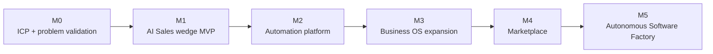

# Product Roadmap — Wedge to Business OS (PROPOSED)

> **Scope:** dependency-ordered product phases M0–M5, mapped onto the
> engineering layers P0–P6 (the phase model of
> [`DEV_CHECKLIST.md`](DEV_CHECKLIST.md) — unchanged; historical task IDs are
> never renumbered). Vision: [`00-product-vision.md`](00-product-vision.md).
> MVP detail: [`02-mvp.md`](02-mvp.md).
>
> **Status:** `proposed` — strategy-level roadmap. Engineering task
> breakdown stays in [`DEV_CHECKLIST.md`](DEV_CHECKLIST.md); this document
> defines phase boundaries, value and non-goals, not task lists. Last
> reviewed: 2026-10-06.

## Governing rule

Do not build all major modules in parallel. ERP + AI + Marketplace +
Automation is the **destination architecture** (decision D2), reached by
dependency order; each phase must deliver a sellable increment on its own.

## Phase map

| Phase | Problem solved | Target user | Value proposition | Engineering layers |
|---|---|---|---|---|
| M0 — ICP + problem validation | "Are we building the wedge for someone who pays?" | Candidate ICP | None (evidence) | None (interviews) |
| M1 — AI Sales agent wedge ([`02-mvp.md`](02-mvp.md)) | Manual, inconsistent lead qualification/follow-up; stale CRM; no visibility | One validated ICP | A working AI sales outcome, sold as a result | P0 + P1 slice + P3 slice |
| M2 — Automation platform | "Automate only the wedge" is too narrow; recurring + event-driven work needed | Same ICP, deeper | Scheduled jobs, event triggers, reusable functions, webhooks, integrations, business rules | P1–P3 |
| M3 — Business OS expansion | Operational data lives in disconnected tools | Same ICP broadening | CRM, orders, products, inventory, customers, supplier ops, analytics as native modules | P3–P4 |
| M4 — Marketplace | Third parties can extend the OS | Function/agent/app authors + buyers | Function, agent, app and supplier/product marketplaces | P5 |
| M5 — Autonomous Software Factory | "The platform builds the business software itself" | All tenants | NL requirements → deployed apps, agents, functions | P6 |

## Per-phase contract

Each phase below must define (and does, in its owner doc or section):
problem solved · target user · value proposition · features · technical
components · dependencies · acceptance criteria · non-goals · metrics.

### M0 — ICP + problem validation

Owner: [`01-problem-and-icp.md`](01-problem-and-icp.md). Exit gate: validated
ICP + problem + WTP evidence; wedge scope locked or pivoted.

### M1 — AI Sales / business agent wedge

Owner: [`02-mvp.md`](02-mvp.md). Dependencies: M0 exit gate; engineering P0
(identity/tenancy) gating. Non-goals: the full must-not-build list of
[`02-mvp.md`](02-mvp.md). Metrics: defined by M0 (leads qualified,
follow-ups sent, replies, pipeline updates, weekly report quality).

### M2 — Automation platform

**Add:** scheduled jobs, event triggers, reusable functions, webhooks,
integrations, business rules. Dependencies: M1's function registry and
tenant model; engineering P3 durable runtime (cron/triggers already
specified in checklist P6.6 items, owned by P3). Non-goals: visual workflow
editor as a primary surface; generic automation for non-ICP segments.

### M3 — Business OS expansion

**Add:** CRM, orders, products, inventory, customers, supplier operations,
analytics — as native modules on the same data/capability layers.
Dependencies: M2's runtime and integrations. Non-goals: full accounting
ERP, ERP-grade compliance suites (destination modules are added gradually
only when a validated customer segment demands them).

### M4 — Marketplace

Owner: [`08-marketplace.md`](08-marketplace.md). Dependencies: versioned
function registry (P5), tenancy/security (P0), demand from M3.

### M5 — Autonomous Software Factory

Owner: [`09-software-factory.md`](09-software-factory.md). Dependencies:
M1–M4 surfaces; engineering P6.

## Roadmap non-goals (global)

- No phase skips its gate; no module is pulled forward "for completeness".
- No generic positioning (see the do-not-position-as list in
  [`00-product-vision.md`](00-product-vision.md)).
- No technology candidate becomes a commitment without an ADR
  ([`10-decisions-and-open-questions.md`](10-decisions-and-open-questions.md)).
