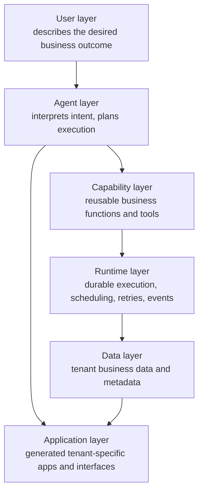

# System Architecture — Target Layers & Technology Candidates (PROPOSED)

> **Scope:** target system architecture for the AI-Native Business OS, the
> layer model, and the technology-candidate register. Vision:
> [`00-product-vision.md`](00-product-vision.md). Agent / function / tenancy
> detail: [`05-agent-runtime.md`](05-agent-runtime.md) ·
> [`06-functions-and-tools.md`](06-functions-and-tools.md) ·
> [`07-multitenancy-security.md`](07-multitenancy-security.md).
> **Current implementation is documented elsewhere and differs**:
> [`llm.md`](llm.md) and [`architecture-diagrams.md`](architecture-diagrams.md)
> describe the live dual-plane system (Go control plane + light Cloudflare
> Worker + React SPA).
>
> **Status:** `proposed` — nothing here is implemented. Technology candidates
> are **assumptions under evaluation, not decisions** (constraint from the
> strategy task: never hard-code them as irreversible; each adoption needs an
> ADR). Last reviewed: 2026-10-06.

## Architecture principles

Outcome first · Agent first · Composable capabilities · Multi-tenant by
design · Durable execution · Human-in-the-loop · Observable execution ·
Secure function execution · Vendor replaceability.

## System layers

- **User layer** — the user (or an integration) states a business outcome in
  natural language; never designs nodes.
- **Agent layer** — intent extraction, plan generation, capability
  selection, permission checks, observation, recovery, escalation
  ([`05-agent-runtime.md`](05-agent-runtime.md)).
- **Capability layer** — typed, authorized, tenant-scoped business
  functions the agents invoke ([`06-functions-and-tools.md`](06-functions-and-tools.md)).
- **Runtime layer** — durable execution with retries, schedules, events,
  approvals and observability (engineering P3,
  [`DEV_CHECKLIST.md`](DEV_CHECKLIST.md)).
- **Data layer** — tenant business data (leads, customers, orders) and
  platform metadata. **Ownership rule:** business data is owned by the
  platform's data layer, never by an AI-orchestration vendor (see the
  candidate register below).
- **Application layer** — tenant-specific interfaces the platform generates
  (today's App Builder output is the seed;
  [`09-software-factory.md`](09-software-factory.md)).

## Outcome → agent → functions → runtime → data

One wedge run reads: the user outcome → the agent extracts intent and
produces a plan → the plan selects capabilities from the registry → each
capability executes durably on the runtime (approval-gated where it has
side effects) → every write lands in tenant-scoped data with an audit
trail → the result is reported back as the outcome the user asked for.

## Technology candidate register (ASSUMPTIONS — not decisions)

| Concern | Live today | Candidate under evaluation | Status / boundary |
|---|---|---|---|
| Frontend | React SPA (`src/`) | SvelteKit | Open (O2). Rewrite only via ADR; the live SPA stays until then. |
| Identity | D1-backed auth in the light Worker | Appwrite | Open (O2). Replacement boundary: auth/session interfaces, not business logic. |
| AI orchestration | Eino (Go) DeepAgent team | Dify | Open (O5). **Dify is never the source of truth for business data**; agents must remain replaceable. |
| Database | Redis (VFS/state) + D1 | TiDB | Open (O2). Tenant business schema candidate; isolation rules in [`07-multitenancy-security.md`](07-multitenancy-security.md). |
| Durable execution | Cloudflare Workflows (7 node types) | Rivet or equivalent | Open (O4). Boundary: the execution interface, not the vendor. |
| Generated app builder | Go control plane generation pipeline | Bolt / bolt.diy | Open (O2). Today's builder remains the reference implementation. |
| Backend gateway | Go Fiber control plane | FastAPI or Rivet gateway | Open (O4). Decide with the runtime choice. |
| Support surface | — | Chatwoot | Candidate; must stay independently deployable and operational. |
| Function runtime | Go tools in the control plane | Bun-based execution where appropriate | Open (O2). Security boundary: sandboxed, tenant-scoped, audited. |

Reading rule: the "live today" column is verified in
[`DEV_STATUS.md`](DEV_STATUS.md); every other cell is an option recorded for
evaluation in [`10-decisions-and-open-questions.md`](10-decisions-and-open-questions.md),
not a commitment. Vendor replaceability is a standing principle: no layer
may couple business logic tightly to one vendor.

## Security model (summary)

Tenant-aware authn/authz on every function call, credential references
(never plaintext), per-call audit with tenant/agent/function identity,
rate limiting, idempotency for business writes, human approval for
external side effects. Full model:
[`07-multitenancy-security.md`](07-multitenancy-security.md).
