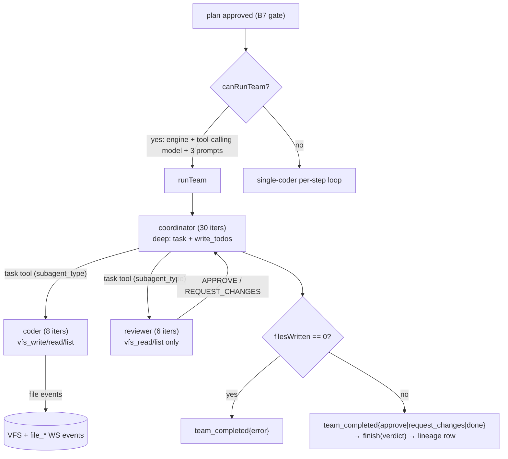

# VibeSDK Multi-Agent Guide

> **Scope:** this guide documents the **live multi-agent team** in the Go control
> plane — coordinator/coder/reviewer built on Eino's **DeepAgent** prebuilt
> (`adk/prebuilt/deep`) with per-role chat models — plus the adjacent Eino ADK
> paths (ReAct engine, plan-execute-replan) that share the same tools, models,
> and WS event contract.
>
> - Authoritative narrative: [`llm.md`](llm.md)
> - Architecture diagram: [`architecture-diagrams.md`](architecture-diagrams.md)
> - Workspace rules: [`../AGENTS.md`](../AGENTS.md)
>
> **Status:** `current` — last verified 2026-10-01 against `backend/pkg/engine/team.go`,
> `backend/pkg/engine/dual_model.go`, `backend/pkg/agent/eino_engine.go`,
> `backend/pkg/skills/registry.go`, `backend/pkg/models/websocket.go`,
> `worker/api/websocketTypes.ts` and `src/routes/chat/utils/handle-websocket-message.ts`.
>
> **Eino version:** `github.com/cloudwego/eino v0.9.21` (`backend/go.mod`). The
> `deep` prebuilt pulls in `adk/filesystem`, which is why
> `github.com/bmatcuk/doublestar/v4` appears as an indirect dependency.

## Contents

| Section | Anchor |
|---|---|
| Design: DeepAgent supervisor, routed by prompt not by graph | [`#design`](#design) |
| DeepAgent runtime contract | [`#deepagent-runtime`](#deepagent-runtime) |
| Roles and skills | [`#roles-and-skills`](#roles-and-skills) |
| Least-privilege tool boundary | [`#least-privilege`](#least-privilege) |
| Path selection: when the team runs | [`#path-selection`](#path-selection) |
| Execution trace (what happens in one team run) | [`#execution-trace`](#execution-trace) |
| WebSocket contract (Go → TS → UI) | [`#websocket-contract`](#websocket-contract) |
| Lineage contribution (P1.3.1) | [`#lineage`](#lineage) |
| Adjacent Eino paths (shared engine, different shape) | [`#adjacent-paths`](#adjacent-paths) |
| Failure modes and guards | [`#failure-modes`](#failure-modes) |
| Known gaps (honest list) | [`#known-gaps`](#known-gaps) |
| Authoritative paths | [`#authoritative-paths`](#authoritative-paths) |

## Design: DeepAgent supervisor, routed by prompt not by graph

> **Descriptive, not prescriptive.** This section describes the team *as built*
> in `backend/pkg/engine/team.go` — it does not claim prompt-routing is the
> only valid supervisor design. The rationale below explains why the current
> shape fits, and where a graph would fit.

The team is a **supervisor built on Eino's `DeepAgent` prebuilt**, not a
compiled Eino graph: `deep.New` (`backend/pkg/engine/team.go:180-191`) creates
one `coordinator` ChatModelAgent that owns the run, and the `coder` and
`reviewer` ChatModelAgents are passed to it as `SubAgents` — reachable through
DeepAgent's built-in `task` tool. Routing decisions live in the coordinator's
system prompt (`backend/skills/00_coordinator.md`, plus the mechanical
`teamToolContract` suffix) — delegate each file step to coder in dependency
order, gate once via reviewer, at most 2 fix rounds — rather than in a branch
node.

### Why DeepAgent and not `supervisor` / workflow agents

This is not a stylistic choice; it is what the library tells you to do. In the
pinned version the module source marks the neighbouring multi-agent APIs
**NOT RECOMMENDED**, with the same wording each time:

> "Agent transfer with full context sharing between agents has not proven to be
> more effective empirically. Consider using ChatModelAgent with AgentTool or
> **DeepAgent** instead for most multi-agent scenarios."

Those markers sit on the `adk/prebuilt/supervisor` package (its `Config` doc
comment), the workflow agents (`adk/workflow.go`, on `WorkflowInterruptInfo` and
the `SequentialAgent`/`LoopAgent`/`ParallelAgent` constructors),
`AgentWithDeterministicTransferTo` (`adk/deterministic_transfer.go`) and the
`Exit`/`OutputKey` fields of `ChatModelAgentConfig` (`adk/chatmodel.go`). So
migrating to `supervisor` or to a sequential/loop workflow agent would be a
documented downgrade. DeepAgent is the agent-as-tool shape the team already
had, plus a task tool, a todo list, and its own `GenModelInput`.

> **Reference convention:** Eino library files are named **without** line
> numbers (e.g. `adk/prebuilt/deep/deep.go`) because
> `scripts/validate-spec-refs.mjs` requires every `path.go:NN` reference to
> resolve to a file *inside this repo* — a dependency path never does, so
> attaching a line suffix to one fails `bun run docs:check`. Symbol names are
> also stable across the library's patch releases, unlike line numbers. Only
> repo-relative paths carry `:line` suffixes.

Why this shape (three structural reasons, all verifiable in code):

1. **Per-role models, one prompt per role.** `runTeam` resolves a separate
   model per role through `roleModel` (`backend/pkg/engine/team.go:280-308`)
   → `Engine.NewRoleModel` (`backend/pkg/agent/eino_engine.go:148-176`), which
   applies each role's `Model`/`MaxTokens`/`Temperature` from the skills
   registry. Roles therefore differ by model *and* prompt. Prompt-routing is
   still the right shape for the *decision* because the supervisor's job is
   judgment — "does this coder task carry enough domain context" — and an Eino
   branch switches on a field value, not on that. A graph around the
   supervisor is possible; a graph *instead of* the prompt is not equivalent.
   (Before DeepAgent this reason read differently: `Engine` had a single model
   slot, so one model for three prompts was the only available option. That
   constraint is gone.)
2. **The supervisor's job is judgment, not switching.** Its work is building
   a fully-contextualized per-file task from an approved prose plan,
   understanding dependency order, and interpreting the reviewer's findings.
   An Eino branch (`NewGraphBranch`) switches on a field value; it cannot
   express "does this coder task carry enough domain context". Even inside a
   graph, the deciding step would still be a model call — i.e. the same
   prompt, wrapped in a node.
3. **State lives on the room.** VFS, `filesWritten`, the lineage record and
   the WS connection all live on `ProjectRoom`. A compiled graph carries its
   own local state (`WithGenLocalState`) — adopting it would mean either
   duplicating room state into graph state (two sources of truth) or reaching
   back into the room from inside nodes (which is what `roomVFSStore` already
   does without the graph). The current shape skips a layer that would add
   no value.

Consequences of the current shape:

- **No static topology to draw as a DAG.** The sequence coder → coder → …
  → reviewer → (coder → reviewer)? emerges at runtime from the coordinator's
  tool calls, so the only fixed edges are request → coordinator and each
  specialist → coordinator (as tool results).
- **State is the room, not a graph struct.** VFS, `filesWritten`, prompts, and
  the generation lineage record all live on `ProjectRoom`; the agents are
  stateless and receive everything per call (see
  [`llm.md`](llm.md#agents-and-teams)).
- **Swapping the supervisor algorithm = editing a prompt file**, not rewiring
  a graph. `SKILLS_DIR` + per-role env overrides apply without a rebuild
  (see [Roles and skills](#roles-and-skills)).

When to reconsider (explicit triggers, not vague "later"):

- **Supervisor/executor model *split by cost class*** → ✅ **partly done; the
  remaining half bundles with P1.8.** Per-role models now exist
  (`Engine.NewRoleModel`, `roleModel`), so the coordinator, coder and reviewer
  each already run on their own registry entry. What is still missing is the
  *policy*: today every role's model is a static registry default, so the team
  runs the same (expensive) configuration on a 3-file plan as on a 12-file one.
  The P1.8 difficulty gate (`docs/DEV_SPEC_P1B.md:15-19`) is what would let a
  run pick a cheaper executor for small plans; implement it as a policy layer
  that *feeds* `roleModel`, not as a second model-plumbing path — the plumbing
  (`NewRoleModel`, env overrides, `eino_engine.go`, skills registry) is already
  in place and duplicating it would create two sources of truth.
- **Eino graph** → only when a *mechanical* branch is needed and must be
  testable in code, e.g. team-vs-single-coder selection or
  review-required-vs-skip as a deterministic `NewGraphBranch`. The graph
  would sit *around* the supervisor (prompt judgment stays inside its node),
  never replace it.

## DeepAgent runtime contract

Three things about `deep` change how the team behaves, and all three are easy
to get wrong.

**1. Delegation goes through `task`, not through a per-role tool.** Every
sub-agent passed in `SubAgents` becomes reachable via DeepAgent's built-in
`task` tool with `{subagent_type, description}` — see
`typedTaskTool.InvokableRun` in `adk/prebuilt/deep/task_tool.go`. The role
*names* are unchanged
(`coder`, `reviewer`) but they are now `subagent_type` values, not tool names.
`WithoutGeneralSubAgent: true` keeps the surface to exactly those two — without
it DeepAgent also registers a `general-purpose` sub-agent
(`generalAgentName` in `adk/prebuilt/deep/types.go`) that the coordinator could
delegate to
instead of the coder. `teamToolContract`
(`backend/pkg/engine/team.go:350-366`) is appended to the coordinator prompt to
state this mechanically.

**2. DeepAgent's built-in task prompt advises parallelism, and that has to be
overridden.** `adk/prebuilt/deep/prompt.go` tells the orchestrator to
"whenever possible, parallelize the work … kick off tasks (subagents) in
parallel". Our build steps are dependency-ordered (data → store/state →
feature logic → UI → `index.html` last), so parallel coder calls could write a
consumer before its dependency. `teamToolContract` therefore ends with an
explicit `OVERRIDE — do NOT parallelize: issue exactly ONE "task" call per turn`
plus `One file per "task" call`. This is a contract the coordinator prompt
alone does not establish, because DeepAgent's own text is appended later in
the context and would otherwise win.

**3. `GenModelInput` must bypass the default's FString pass — this is
load-bearing, not defensive.** DeepAgent's built-in `write_todos` handler calls
`adk.AddSessionValue(ctx, SessionKeyTodos, …)` (`typedNewWriteTodos` in
`adk/prebuilt/deep/deep.go`), and the task tool runs every sub-agent with
`withSharedParentSession()` (`typedAgentTool.InvokableRun` in
`adk/agent_tool.go`) — so sub-agents **do**
observe that session value. The ADK default `GenModelInput` only runs
`prompt.FromMessages(schema.FString, …)` **when session values are present**,
and hard-fails the whole run on literal curly braces
(`defaultGenModelInput` in `adk/chatmodel.go`). `backend/skills/02_coder.md` contains
`if (el) { ... }` and `01_planner.md` a full JSON example, so the default would
break both sub-agents. `noFormatInstruction`
(`backend/pkg/engine/team.go:310-334`) returns the instruction verbatim and is
set on coder and reviewer; the coordinator gets the equivalent from deep's own
`typedGenModelInput` (`adk/prebuilt/deep/deep.go`). **Do not remove it,
and do not add `WithSessionValues` anywhere near these agents without
re-checking this.**

Iteration budget: the coordinator runs `MaxIteration: 30`
(`backend/pkg/engine/team.go:186`) — above the pre-DeepAgent value of 24 —
because a deep run now spends turns on `write_todos` in addition to delegating.
`EmitInternalEvents: true` on the coordinator's `ToolsConfig` is what forwards
sub-agent output to the runner, which is what gives the WS stream its
`[coder] `/`[reviewer] ` prefixes (see [WebSocket contract](#websocket-contract)).

## Roles and skills

Every role maps to **one model + one markdown prompt file**. Defaults live in
`backend/pkg/skills/registry.go:56-87`; prompts in `backend/skills/`;
per-role overrides via `<ROLE>_MODEL`, `<ROLE>_MAX_TOKENS`,
`<ROLE>_TEMPERATURE`. `Registry.Load()` fails fast on a missing/empty file, so
prompt-less model calls never happen silently.

| Role | Skill file | Default model | Temp | Max tokens | Agent iterations (`team.go`) |
|---|---|---|---|---|---|
| `coordinator` | `00_coordinator.md` | `@cf/meta/llama-3.3-70b-instruct-fp8-fast` | 0.2 | 8192 | 30 (`backend/pkg/engine/team.go:186`) |
| `coder` | `02_coder.md` | `@cf/qwen/qwen2.5-coder-32b-instruct` | 0.1 | 8192 | 8 (`backend/pkg/engine/team.go:135`) |
| `reviewer` | `03_reviewer.md` | `@cf/meta/llama-3.3-70b-instruct-fp8-fast` | 0.1 | 4096 | 6 (`backend/pkg/engine/team.go:150`) |

The first five columns are **enforced**: `roleModel`
(`backend/pkg/engine/team.go:280-308`) looks each role up in the registry and
hands `Model`/`MaxTokens`/`Temperature` to `Engine.NewRoleModel`
(`backend/pkg/agent/eino_engine.go:148-176`), which builds a separate provider
client per role. Only the iteration column is hard-coded in `team.go`. A
registry miss or a provider rejection logs and falls back to the engine model —
a typo in `CODER_MODEL` degrades one role, it does not fail the run.

Notes that matter for operators:

- The coordinator prompt (`00_coordinator.md`) is the **routing policy**: one
  file per coder call, dependency order data → store → logic → UI →
  `index.html` last, reviewer called ONCE, then ≤ 2 fix rounds on flagged
  files only.
- The coder prompt (`02_coder.md`) is shared with the dual-model single-coder
  path — one file task per call, raw content only (a wrapping fence is drift
  and gets stripped).
- The reviewer prompt (`03_reviewer.md`) owns the **verdict contract**: the
  ENTIRE response is `APPROVE` (+ one line per file) or `REQUEST_CHANGES` (+
  one bullet per issue with path + concrete fix). The Go side parses it with
  `parseReviewVerdict` (`backend/pkg/engine/team.go:386-398`): contains `APPROVE` → `approve`,
  else contains `REQUEST_CHANGES` → `request_changes`, else `done`.

## Least-privilege tool boundary

`teamTools` (`backend/pkg/engine/team.go:64-95`) builds the per-role sets.
This is a **physical** boundary (separate tool lists per agent), not a prompt
suggestion:

| Agent | Tools | Writes VFS? |
|---|---|---|
| `coder` | `vfs_write` (via `notifyWriteTool`, so writes replay as `file_*` WS events), `vfs_read`, `vfs_list` | **yes** (author `coder`) |
| `reviewer` | `vfs_read`, `vfs_list` | **no — cannot modify the VFS** |
| `coordinator` | `task` + `write_todos` (both injected by the DeepAgent prebuilt) | no (only via `task` → coder) |

The reviewer prompt additionally says "read-only", but the enforcement is the
tool list: even a prompt-injected reviewer has no write tool to call. All tool
calls run under `tools.WithVFSContext(ctx, chatID)` (`backend/pkg/engine/team.go:117`), so the
model can never choose whose VFS it touches.

The coordinator is the one row DeepAgent changes: it no longer receives
`coder`/`reviewer` as two named tools but a single `task` tool whose
`subagent_type` selects between them. The boundary is unchanged in substance —
the coordinator still has **no file tool of its own** and every write still
passes through the coder's `vfs_write` — but the enforcement now lives in
`WithoutGeneralSubAgent: true` plus the `teamToolContract` suffix rather than in
a hand-built tool list.

## Path selection: when the team runs

The team is **one branch of Path 1 (dual-model)**, taken only after plan
approval. `runDualModelPipeline` (`backend/pkg/engine/dual_model.go:176-194`):

1. `canRunTeam` (`backend/pkg/engine/team.go:56-62`) = engine present (`r.eng != nil`) **and**
   tool-calling model (`SupportsPlanExecute`, `backend/pkg/agent/eino_engine.go:110-113`)
   **and** all three team prompts loaded.
2. True → `runTeam` → its returned verdict is recorded in the lineage row via
   `finish(verdict)` (`backend/pkg/engine/dual_model.go:191`) → `finalizeGeneration` → return.
   **No fallthrough to the single-coder loop.**
3. False → the sequential per-step coder loop below (`backend/pkg/engine/dual_model.go:195+`).
4. A team **error** (`terr != nil`) aborts the run (`dual-model: team: %w`)
   — it does NOT fall through to the single-coder loop either.

So there are exactly two execution shapes inside Path 1 (team vs single
coder), selected once per run by `canRunTeam`. If the engine is nil or the
model cannot tool-call, the team silently does not exist and the run degrades
to the single-coder loop — check the backend log line `executing plan via
multi-agent team` (`backend/pkg/engine/dual_model.go:177`) to confirm which shape a run took.

## Execution trace (what happens in one team run)

`runTeam` (`backend/pkg/engine/team.go:112-278`):

1. Resolve a model **per role** via `roleModel`
   (`backend/pkg/engine/team.go:280-308`) — coder, reviewer and coordinator each
   get their own provider client with that role's model/temperature/token
   budget, falling back to the engine model on any failure.
2. Build `coderTools` / `reviewerTools` via `teamTools`; reset
   `filesWritten` to 0 (`backend/pkg/engine/team.go:118`).
3. Construct the two sub-agents — coder (8 iterations,
   `backend/pkg/engine/team.go:129-140`) and reviewer (6,
   `backend/pkg/engine/team.go:144-154`) — each with
   `GenModelInput: noFormatInstruction` and `EmitInternalEvents: true`, then
   build the coordinator with `deep.New` (30 iterations,
   `backend/pkg/engine/team.go:180-191`) passing them as `SubAgents`, and run
   `adk.NewRunner{Agent: coordinator, EnableStreaming: true}` with the task
   `Original user request + Approved build plan + Delegate each file step to
   coder now, then gate once via reviewer` (`backend/pkg/engine/team.go:201-203`).
4. Drain the event iterator: streaming chunks → `broadcastTeamToken`
   (coordinator text verbatim; others prefixed `[name] `); tool calls →
   `subagent_activity`; coordinator text accumulates into `finalText`.
5. **Zero-files guard** (`backend/pkg/engine/team.go:257-264`): `filesWritten == 0` is an error
   (`team_completed{verdict: error}` + `team: run finished without writing any
   files`). A team run can never be a silent success.
6. Verdict = `parseReviewVerdict(finalText)` or `done`; broadcast
   `team_completed{verdict, summary≤2000 runes}`; run
   `fillMissingReferencedFiles`; return the verdict.
7. Every event-drain error broadcasts `team_completed{verdict: error}` before
   returning, so the UI never hangs on a dead run.

## WebSocket contract (Go → TS → UI)

The team emits exactly four shapes on the room socket, all defined once in
`backend/pkg/models/websocket.go:154-176`, mirrored in
`worker/api/websocketTypes.ts:112-132`, dispatched in
`src/routes/chat/utils/handle-websocket-message.ts:738-762`. File content
itself still streams via the standard `file_*` events — team events carry
only delegation trace + verdict.

| # | Event | Go source | Frontend behavior |
|---|---|---|---|
| 1 | `team_started` | `backend/pkg/engine/team.go:196` (`TeamStarted`) | thinking+generating on; chat line `Multi-agent team started…` |
| 2 | `conversation_response` (`team-<chatID>`) | `broadcastTeamToken` (`backend/pkg/engine/team.go:368-384`) | streamed as normal assistant text (sub-agent text prefixed `[name] `); `IsStreaming: false` |
| 3 | `subagent_activity{agentName, toolName}` | `backend/pkg/engine/team.go:248-254` (`SubAgentActivity`) | render-only tool chip `agent:tool` (`status: start`); never touches VFS |
| 4 | `team_completed{verdict, summary?}` | `backend/pkg/engine/team.go:271-275` (`TeamCompleted`) | thinking/generating off; `error` → toast; always a chat line `Team <verdict>[: summary]` |

Verdict vocabulary: `approve` | `request_changes` | `done` (no explicit
verdict in the closing text) | `error` (see `summary`). Protocol changes
must stay SDK-compatible — the SDK re-exports `worker/api/websocketTypes.ts`.

## Lineage contribution (P1.3.1)

One generation = one `generations` row. The record opens in
`runDualModelPipeline` (`backend/pkg/engine/dual_model.go:41-85`) **before** any write, and
`runTeam` deliberately opens **no** record of its own (it is nested inside
that run; a second pair would double-count and break the parent chain —
`backend/pkg/engine/team.go:107-111`). The team's contribution is the returned verdict string:
`approve` / `request_changes` from the reviewer, `done` otherwise, always
non-empty on success (`backend/pkg/engine/team.go:101-105`). The caller records it via
`finish(verdict)` (`backend/pkg/engine/dual_model.go:191`) before `finalizeGeneration`.

## Adjacent Eino paths (shared engine, different shape)

Same engine (`backend/pkg/agent/eino_engine.go`), same model, same tool
families — but NOT the team. Do not confuse them:

- **Stateless ReAct engine** (`backend/pkg/agent/eino_engine.go:201-285`,
  `RunStepWith`): one
  `adk.ChatModelAgent` + `adk.Runner`, no per-session state (history in/out
  via `store.RedisCheckpointStore`), `StreamEvent{token,tool_call,
  tool_result,done}`. Serves `/ws-agent/:id` and backs `Room.streamLLM`.
  The `tolerantStreamModel` wrapper (`tolerant_model.go`) turns one malformed
  stream frame (Workers AI numeric `content`) into a graceful end instead of
  a `NodeRunError`. This path still uses the **engine's single model**
  (`EngineConfig.Model`); the per-role models described above exist only for
  the team. Note it also ignores the `maxTokens` argument `Room.streamLLM`
  passes it — see [Known gaps](#known-gaps).
- **Plan-execute-replan** (`plan_execute.go`, Path 2 fallback):
  `planexecute` prebuilt (planner → executor → replanner,
  `MaxIterations: 4`) over `roomVFSStore`; writes replay as `file_*` via
  `notifyWriteTool`. Also zero-files-guarded.

## Failure modes and guards

| Failure | Guard | Where |
|---|---|---|
| Model cannot tool-call / engine nil / prompts missing | team never selected; single-coder loop runs | `canRunTeam` (`backend/pkg/engine/team.go:56-62`) |
| A role's registry model is unusable | log + that role falls back to the engine model; run continues | `roleModel` (`backend/pkg/engine/team.go:280-308`) |
| Team writes nothing (silent success) | error + `team_completed{error}` | `backend/pkg/engine/team.go:257-264` |
| Event-drain error mid-run | `team_completed{error}` broadcast, UI unblocked | `backend/pkg/engine/team.go:213-220` |
| Reviewer never emits a verdict | verdict defaults to `done` | `backend/pkg/engine/team.go:266-270` |
| Coordinator tries to parallelize (deep's built-in task prompt advises it) | prompt-level `OVERRIDE` in `teamToolContract` — **not code-enforced** | `backend/pkg/engine/team.go:350-366` |
| Sub-agent prompt contains `{`/`}` (both coder and planner do) | `noFormatInstruction` skips the default's FString pass | `backend/pkg/engine/team.go:310-334` |
| Generation cancelled mid-team | `generationContext` closes ctx; streams end; `generation_cancelled` | `room.go` lifecycle |
| Plan rejected at the gate | team never starts (`errPlanRejected` is final) | `dual_model.go` B7 gate |

## Known gaps (honest list)

1. **No end-to-end test of a real team run.** Without a live engine
   `canRunTeam` stays false in tests; reviewer-verdict parsing is covered
   (`TestParseReviewVerdict`) but a full approve-path run is manual-only
   (`docs/DEV_SPEC_P1A.md:71`).
2. **No difficulty gate yet (P1.8).** Today the team runs whenever
   `canRunTeam` is true — small plans pay the 3-agent overhead. The
   `ShouldUseTeam` gate is specified in `docs/DEV_SPEC_P1B.md:15-19` but not
   implemented.
3. **Reviewer sees paths, not diffs (P1.6).** The reviewer task carries no
   `changed_files` list yet (`docs/DEV_SPEC_P1B.md:3-8`); its verdict is
   absolute, not relative to the previous generation.
4. **No claim protocol (P1.9).** Concurrent coder writes to one path rely on
   last-write-wins; `vfs_claim`/`release`/`status` are specified in
   `docs/DEV_SPEC_P1B.md:21-25` but not implemented.
5. **Verdict parsing is substring matching.** Any `APPROVE` anywhere in the
   closing text (even quoted discussion) yields `approve`
   (`backend/pkg/engine/team.go:386-398`).
6. **`maxTokens` is silently dropped on the engine path.** `Room.streamLLM`
   accepts a `maxTokens` argument and forwards it to the raw client, but when
   the engine is live it calls `Engine.RunStepWith`, which takes no budget — so
   the per-role `*_MAX_TOKENS` overrides and the truncation-retry doubling
   (`maxTokens *= 2`) are **no-ops** whenever a tool-calling engine is
   configured. This affects the dual-model single-coder and legacy
   fence-streaming paths, not the team (whose budgets are baked into each role's
   model). The fix is to pass `model.WithMaxTokens` through
   `adk.WithChatModelOptions`; tracked as gap **G-maxTokens** in
   `docs/DEV_CHECKLIST.md`. Not enforced by any test today.

## Authoritative paths

| Area | Path |
|---|---|
| Team implementation (DeepAgent coordinator + sub-agents) | `backend/pkg/engine/team.go` |
| `task` tool / `write_todos` (library-injected) | `adk/prebuilt/deep/task_tool.go`, `adk/prebuilt/deep/deep.go` |
| Per-role model construction | `backend/pkg/agent/eino_engine.go:148-176` (`NewRoleModel`) |
| FString-bypassing instruction input | `backend/pkg/engine/team.go:310-334` (`noFormatInstruction`) |
| Path selection + lineage recording | `backend/pkg/engine/dual_model.go:176-194` |
| Stateless engine + capability probe | `backend/pkg/agent/eino_engine.go:101-113` |
| Role prompts | `backend/skills/00_coordinator.md`, `02_coder.md`, `03_reviewer.md` |
| Role registry (model/temp/tokens) | `backend/pkg/skills/registry.go:56-87` |
| WS event structs (Go truth) | `backend/pkg/models/websocket.go:154-176` |
| WS event mirror (TS) | `worker/api/websocketTypes.ts:112-132,669-671` |
| Frontend dispatch | `src/routes/chat/utils/handle-websocket-message.ts:738-762` |

---

_Last reviewed: 2026-10-01 against the files listed in the scope header (Eino v0.9.21, DeepAgent coordinator)._
