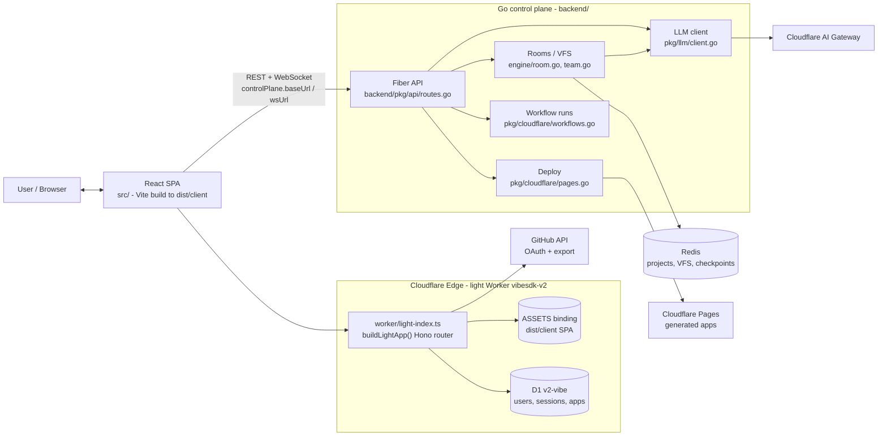

# VibeSDK Architecture Diagrams

> **Scope:** this document covers the **current dual-plane architecture only**.
> Historical diagrams were archived — see [Historical diagrams (removed)](#historical-diagrams-removed).
>
> - Authoritative narrative: [`llm.md#current-architecture`](llm.md#current-architecture)
> - Multi-agent team guide: [`MULTI_AGENT.md`](MULTI_AGENT.md)
> - Per-endpoint route ownership (which plane serves what): [`POSTMAN_COLLECTION_README.md`](POSTMAN_COLLECTION_README.md) §7
> - Platform limits: [`CF_LIMITS.md`](CF_LIMITS.md)

## Current architecture (dual-plane)

**Status:** `current` — last verified 2026-09-25 against `worker/light-index.ts`,
`worker/light/lightApp.ts`, `backend/pkg/api/routes.go`, `wrangler.v2.jsonc` and
`src/config/api.ts`.

### Plane responsibilities

| Plane | Runtime & entry point | Responsibilities | Frontend config |
|---|---|---|---|
| **Edge / auth** (light Worker) | Cloudflare Worker `vibesdk-v2` — `worker/light-index.ts` to `buildLightApp()` in `worker/light/lightApp.ts`; bindings in `wrangler.v2.jsonc` | Serves the SPA through the `ASSETS` binding; D1-backed auth (`/api/auth/*`), GitHub OAuth + GitHub App export, read-only app lists, `/api/status`, `/api/capabilities`, `/api/limits/usage`. Unknown `/api/*` answers JSON `404`; chat/project/WebSocket paths answer JSON `503 NOT_AVAILABLE`; every other path returns the SPA HTML. | `authPlane.baseUrl` |
| **Control** (Go) | Go Fiber service in `backend/` — `backend/pkg/api/routes.go` | Agent sessions and streaming (`POST /api/agent`, `POST /api/agent/session`, `GET /api/agent/:id/connect`), rooms/VFS and deploys (`/api/projects/:id/files`, `.../deploy`, `.../github-export`), WebSocket (`GET /ws/:id`), workflow runs (`/api/workflows/*`). Streams from AI Gateway (`backend/pkg/llm/client.go`), keeps project and VFS state in Redis, deploys generated apps to Cloudflare Pages. | `controlPlane.baseUrl` · `controlPlane.wsUrl` |
| **Execution** (optional) | Cloudflare Edge (Workers / Workflows / Vectorize) | End-user agent execution when `VITE_EXECUTION_PLANE_URL` is set; features that depend on it stay disabled when the value is empty. | `executionPlane.baseUrl` |

HTTP from the SPA goes through `src/lib/api-client.ts` and
`src/services/controlPlaneClient.ts`. `src/config/api.ts` is the single place that
resolves the plane base URLs (each falls back to `window.location.origin` when its
Vite variable is unset).

### Bindings (light Worker)

| Binding | Resource | Purpose |
|---|---|---|
| `ASSETS` | `dist/client` | SPA serving + `single-page-application` fallback |
| `DB` | D1 `v2-vibe` | auth, sessions, apps, favorites |
| `VibecoderStore` | KV | session and cache data for the light Worker |
| `AI` | Workers AI (remote) | AI binding available to the light Worker |
| `WORKFLOWS` | Workflows `vibesdk-v2-workflows` (`VibeWorkflow`) | DAG workflow interpreter backed by the `workflow_*` D1 tables |

> `TEMPLATES_BUCKET` (R2) is intentionally **not** bound: the light Worker never
> reads it at runtime — see the comment in `wrangler.v2.jsonc`.
>
> **Maintenance rule (T16):** the binding set lives in three places that must agree —
> `wrangler.v2.jsonc` (deployment truth), `worker-configuration.d.ts` (regenerate with
> `bun run cf-typegen`) and this table. Adding or removing a binding therefore means:
> edit the config → `bun run cf-typegen` → update this table, all in the same change.
> `bun run docs:check` fails when they disagree (`scripts/validate-docs-invariants.mjs`).

## Historical diagrams (removed)

> **Historical / removed in dual-plane migration.** The diagrams below are kept in
> [`archive/architecture-legacy.md`](archive/architecture-legacy.md), each prefixed
> with a `legacy - removed in the dual-plane migration` status label. Do not use
> them to describe the current system.

Components and paths removed by the migration — do not document them as live:

- ThinkAgent, SpaceDO, Cloudflare Artifacts, Worker Loader, App Facet — `space/` was deleted and nothing imports it.
- CodeGen Durable Object, Cloudflare Agents SDK state machine, and phase-based generation (`Blueprint to Phase to Review to Fix`).
- Hono route tree `worker/api/routes/`, `worker/agents/**`, `worker/database/services/` — these do not exist in this repo.
- Cloudflare Sandbox SDK, Containers, dispatch namespaces, and sandbox preview containers.
- `/api/agent*`, `/api/projects/*` and `/ws/*` on the Edge Worker — they answer `503 NOT_AVAILABLE`; the Go control plane owns them.

