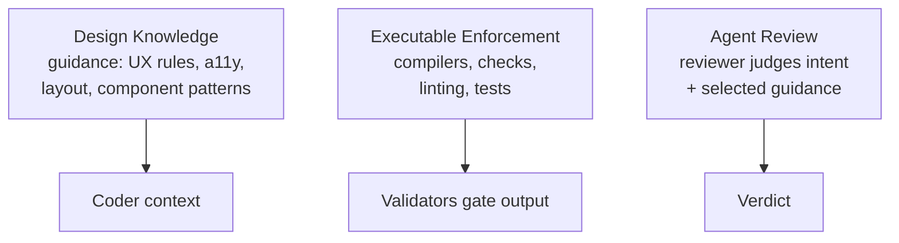
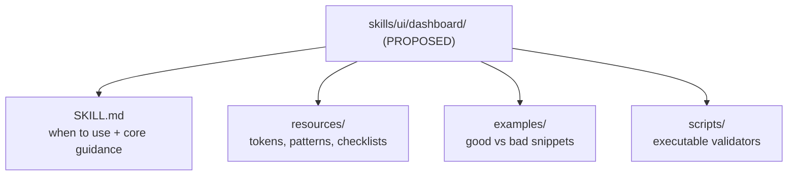

# Dynamic Design Skill Layer — Architecture (PROPOSED)

> **Scope:** proposed architecture for integrating external design-skill
> knowledge as a *Dynamic Design Skill Layer* on top of the live Go
> control-plane team. Companion docs:
> [`adr-dynamic-design-skill-layer.md`](adr-dynamic-design-skill-layer.md) (decision),
> [`../skills/design-skill-authoring.md`](../skills/design-skill-authoring.md) (authoring),
> [`../skills/design-skill-consumption.md`](../skills/design-skill-consumption.md) (consumption).
>
> **Status:** `proposed` — **not implemented**. Nothing in this document
> describes live behavior. Current behavior is documented in
> [`../MULTI_AGENT.md`](../MULTI_AGENT.md),
> [`../llm.md`](../llm.md) and
> [`../architecture-diagrams.md`](../architecture-diagrams.md).
>
> **Labels used below:** `Current` = verified in code today. `Proposed` =
> specified here, not built. `Future` = explicitly out of scope for the
> next implementation contract.
>
> Last reviewed: 2026-10-05.

## Contents

| Section | Anchor |
|---|---|
| Corrections to the request context | [`#context-corrections`](#context-corrections) |
| Problem statement | [`#problem`](#problem) |
| Why static role prompts are insufficient | [`#why-static-insufficient`](#why-static-insufficient) |
| Goals / Non-goals | [`#goals`](#goals) |
| Current state | [`#current-state`](#current-state) |
| Target architecture | [`#target`](#target) |
| External repository roles | [`#repo-roles`](#repo-roles) |
| Skill packaging model | [`#packaging`](#packaging) |
| Dynamic selection and composition | [`#selection`](#selection) |
| Context-budget strategy | [`#context-budget`](#context-budget) |
| Validation strategy | [`#validation`](#validation) |
| Versioning, provenance, trust | [`#versioning`](#versioning) |
| Failure, fallback, observability, security | [`#failure`](#failure) |
| Migration path | [`#migration`](#migration) |
| Risks and trade-offs | [`#risks`](#risks) |
| Examples | [`#examples`](#examples) |

## Corrections to the request context

The task brief describes a `Go Eino + SvelteKit + Tailwind` stack with
skills at `backend/pkg/skills/`. The verified repo reality differs and
this spec follows reality:

- **Skills prompts live in `backend/skills/`** (`backend/skills/00_coordinator.md`,
  `backend/skills/01_planner.md`, `backend/skills/02_coder.md`,
  `backend/skills/03_reviewer.md`). `backend/pkg/skills/` holds the Go
  loader/registry only (`backend/pkg/skills/registry.go`,
  `backend/pkg/skills/load.go`). Any brief reference to
  `backend/pkg/skills/00_coordinator.md` is corrected here.
- **Roles are coordinator/planner/coder/reviewer** — not only the three
  named in the brief. Defaults are registered in
  `backend/pkg/skills/registry.go:56`.
- **Frontend is a React SPA** (`src/`, Vite build to `dist/client`),
  served by the light Worker — not SvelteKit. See
  `docs/architecture-diagrams.md:13`.
- **Generated apps are static SPAs with vanilla CSS tokens, no Tailwind
  CDN, no UI kits.** The live coder contract forbids external CDNs and

## Problem statement

`Current`: each role loads exactly one verbatim prompt file at startup
(`backend/pkg/skills/load.go:10`, `backend/pkg/skills/registry.go:89`).
The coordinator delegates file-by-file, the coder writes one complete
file per call, the reviewer checks wiring/tokens/subject against the
same task requirements.

`Proposed` problem: UI quality depends on design knowledge
(accessibility, layout, hierarchy, states, error handling) that does
not fit in a single static coder prompt and varies per request type
(dashboard vs landing page vs form). Stuffing every rule into
`backend/skills/02_coder.md` blows the context budget and leaks
irrelevant guidance into every generation.

## Why static role prompts are insufficient

1. **One prompt per role, loaded verbatim.** `Registry.Load` returns the
   full text keyed by role with no selection step
   (`backend/pkg/skills/load.go:15`).
2. **No per-intent variation.** The same coder text serves a SaaS
   dashboard and a coffee-shop landing page; relevance must be encoded
   as generic prose.
3. **Context cost is fixed.** Every token in the static file is paid on
   every call whether the task needs it or not.
4. **Design intent lives in two places.** Planner emits a per-request
   `design` block (`backend/skills/01_planner.md:11`) while coder also
   carries static quality prose — with no registry resolving which
   guidance applies.
5. **Reviewer has no design-intent input.** It receives paths +
   requirements (`backend/skills/03_reviewer.md:7`) but not the selected
   skill set, so design review is ad-hoc.

## Goals / Non-goals

Goals (`Proposed`):

- Keep a small static base prompt per role; add only relevant design
  knowledge per request.
- Resolve skills by metadata (intent → skill set), not by concatenating
  repositories.
- Keep artifacts local, versioned, reviewable — no opaque runtime fetch.
- Keep knowledge (guidance) separate from enforcement (executable
  checks) and from review (agent verdict).
- Stay compatible with the coordinator/coder/reviewer team shape in
  `docs/MULTI_AGENT.md:41` and the execution trace in
  `docs/MULTI_AGENT.md:30`.

Non-goals:

- No new runtime service for design skills.
- No automatic network fetching at generation time.
- No change to the live registry, prompts, API contracts, Worker, or
  Eino runtime in this phase.
- No Tailwind/UI-kit runtime in generated apps (still forbidden by the
  live coder contract).

## Current state

- Roles and defaults: `backend/pkg/skills/registry.go:56`
  (coordinator/planner/coder/reviewer with model, skill file,
  temperature, max tokens).
- Loader semantics: fail-fast on missing/empty files
  (`backend/pkg/skills/load.go:15`, `backend/pkg/skills/load.go:28`).
- Directory resolution: `SKILLS_DIR` override plus conventional
  candidates (`backend/pkg/skills/load.go:66`).
- Team wiring: DeepAgent coordinator with coder/reviewer sub-agents
  (`backend/pkg/engine/team.go:180`), per-role models
  (`backend/pkg/agent/eino_engine.go` per `docs/MULTI_AGENT.md:457`).
- Coverage is honest about gaps (no difficulty gate, reviewer sees
  paths not diffs) in `docs/MULTI_AGENT.md:419`.

  UI kits (`backend/skills/02_coder.md:151`,
  `backend/skills/01_planner.md:122`). Tailwind knowledge from external
  sources is therefore *design guidance to distill*, not a runtime to
  inject into generated output — unless a later ADR explicitly lifts
  that constraint.
- **No `docs/architecture/` or `docs/skills/` tree existed before this
  change**; the four files created by this task establish them.

## Target architecture (`Proposed`)

### Dynamic Skill Flow

```mermaid
flowchart LR
    U["User request"] --> C["Coordinator<br/>interprets intent"]
    C --> R["Skill Resolver<br/>(proposed, not built)"]
    R --> REG["Skill Registry<br/>resolves metadata + content"]
    REG --> CC["Context Composer<br/>selects only relevant knowledge"]
    CC --> COD["Coder<br/>base prompt + selected skills"]
    COD --> VFS[("VFS<br/>implementation")]
    VFS --> VAL["Static validators<br/>executable checks"]
    VAL --> REV["Reviewer<br/>task requirements +<br/>selected design guidance"]
```

Each box is a concept, not a shipped component. `Skill Resolver` and
`Context Composer` do not exist in code; the current `Registry` only
maps roles to one prompt file each
(`backend/pkg/skills/registry.go:89`). The diagram is the composition
contract a future implementation must honor: intent → metadata
resolution → minimal context → generation → executable validation →
review against the same intent.

### Separation of Concerns

Knowledge informs, tools enforce, the reviewer judges. Prompts never
substitute for a check a machine can run, and checks never substitute
for intent judgment.

### Skill Structure (`Proposed` example — not a live path)

The `skills/ui/` prefix is illustrative. The live skills directory is
flat (`backend/skills/`); no `ui/` subdirectory exists. A future
implementation may choose a different root — this spec fixes the
*interior shape* (SKILL.md + resources + examples + scripts), not
the root path.

### Relationship: coordinator, registry, coder, reviewer

- **Coordinator** interprets intent and names the required skill set
  per file step (e.g. dashboard step → ui-fundamentals,
  dashboard). It does not paste skill bodies.
- **Registry** (future extension of `backend/pkg/skills/registry.go`)
  resolves names → versioned metadata → content, reporting missing or
  conflicting entries explicitly.
- **Composer** trims to the minimal relevant slice under a per-call
  token budget; unrelated skills never enter coder context.
- **Coder** receives base role prompt + selected slice, writes to VFS.
- **Reviewer** receives the same selected slice plus task requirements
  and judges conformance — distinguishing hard constraints (wiring,
  tokens, syntax) from subjective guidance (taste, density).

## External repository roles (knowledge sources, not dependencies)

None of these repositories is a production dependency. They are
curated inputs to distill into versioned local skill artifacts:

| Source | Narrow role in this architecture |
|---|---|
| awesome-design-skills | Design knowledge: UX rules, accessibility, layout, Tailwind and visual-design guidance to distill. |
| awesome-design-md | Design-system and agent-oriented design guidance to distill. |
| bergside/typeui | UI/design skill and structured design guidance. **No claim is made** that it provides a TypeScript compiler or runtime type system. |
| google-labs-code/stitch-skills | Reference architecture for *packaging* skills (SKILL.md, resources, examples, scripts) — the structural model this spec adopts. |

Principles: never copy a repository wholesale; extract scoped,
attributed guidance; project-local rules override generic external

## Dynamic selection and composition (`Proposed`)

Conceptual flow (`Proposed`; resolver/composer do not exist yet):

1. User request arrives with approved plan.
2. Coordinator interprets intent per file step.
3. Skill resolver identifies relevant skills by metadata
   (intent keywords, file type, plan design block).
4. Registry resolves metadata → versioned content or an explicit
   missing-skill error.
5. Context composer selects only the relevant slice within budget.
6. Coder receives base prompt + slice; writes to VFS.
7. Static validators check the output.
8. Reviewer evaluates against task requirements + the same slice.

Example resolution (`Proposed`): intent "Build a SaaS admin
dashboard" → `ui-fundamentals`, `dashboard` (+ base stack guidance
as distilled local rules — not a Tailwind CDN, which the live
contract forbids). A landing-page intent resolves a different set;
dashboard rules must not enter landing-page context.

## Context-budget strategy (`Proposed`)

- Base prompts stay small; skills are opt-in per call.
- Composer enforces a per-call token ceiling; SKILL.md core guidance
  outranks resources, which outrank examples.
- Irrelevant skills are excluded, never truncated into noise.
- Missing skills fail open with a logged warning (generate from base
  prompt) unless the skill is marked required, in which case the step
  fails closed with an explicit error.

## Validation strategy: knowledge vs enforcement

| Concern | `Proposed` mechanism |
|---|---|
| Design knowledge | Versioned skill guidance in coder context. |
| Executable enforcement | Linters, syntax checks, token-usage checks, tests — machines, not prose. |
| Review | Reviewer verdict against requirements + selected guidance; subjective taste never blocks on its own. |

The live reviewer contract already models this split (strict but
fair; only flag rendering/wiring/requirement breaks) in
`backend/skills/03_reviewer.md:39`.

## Versioning, provenance, trust, caching (`Proposed`)

- **Versioning:** each skill carries a semver version in SKILL.md
  front-matter; the resolver pins versions per generation for
  reproducibility.
- **Provenance:** each skill lists source repositories + commit/date +
  distillation notes; no unattributed guidance.
- **Trust/review:** imported knowledge requires human review before
  landing (like a code change); project-local rules outrank generic
  external guidance.
- **Caching/vendor:** artifacts are vendored locally under version
  control. No runtime network fetch is proposed; if a future cache is
  adopted it must be content-pinned and reviewable.

## Failure, fallback, observability, security (`Proposed`)

- **Missing skill:** warn + continue on base prompt, or fail the step
  if marked required. Never silently substitute an unrelated skill.
- **Conflicting guidance:** higher-priority project-local rules win;
  the conflict is surfaced in the run log.
- **Fallback:** base role prompts alone must always produce a valid
  (if plainer) output.
- **Observability (`Future`):** log resolved skill names + versions +
  token cost per call; surface them in generation lineage.
- **Security:** skills are prompt content — treat as untrusted input:
  review on import, no executable scripts run at generation time
  without sandboxing, no secrets in skill files, no network fetch.

## Migration path from static prompts

1. **Docs only (this task):** the four files in this change.
2. Distill one pilot skill (e.g. `ui-fundamentals`) as local
   Markdown; no loader changes.
3. Extend the registry with metadata resolution behind a flag; keep
   `Load` semantics as fallback.
4. Wire resolver → composer → coder/reviewer context on one intent;
   measure token cost and quality.
5. Graduate executable checks from prose to scripts.

## Risks and trade-offs

- Stale skills rot faster than code — versioning + review burden.
- Over-scoped skills re-create the monolith — keep skills narrow.
- Resolver mis-selection injects noise — prefer fewer, higher-signal
  skills and log selections.
- External sources change licenses/content — provenance + vendoring
  mitigate, not eliminate.

## Examples (`Proposed` behavior illustrations, not live runs)

### Dashboard generation

Intent "Build a SaaS admin dashboard" → resolver selects
`ui-fundamentals` + `dashboard`. Composer includes density/table/
empty-state guidance; coder writes `public/index.html`,
`public/styles.css`, `public/js/*.js` per plan; validators check
syntax/wiring/tokens; reviewer checks the same slice (e.g. tables
have headers, empty states exist) without inventing new taste rules.

### Landing-page generation

Intent "coffee-shop landing page" → resolver selects
`ui-fundamentals` + `landing-page`. Dashboard table/density rules are
explicitly excluded — this is the point of dynamic selection.

### Conflicting guidance

Generic external guidance says "dense data tables"; project-local
rule says "marketing pages use generous whitespace". Project-local
wins; the run log notes the override. The reviewer must not flag the
generous spacing as a defect.

---

_Related: [`adr-dynamic-design-skill-layer.md`](adr-dynamic-design-skill-layer.md),
[`../skills/design-skill-authoring.md`](../skills/design-skill-authoring.md),
[`../skills/design-skill-consumption.md`](../skills/design-skill-consumption.md).
Current team behavior: [`../MULTI_AGENT.md`](../MULTI_AGENT.md)._

guidance on conflict.

## Skill packaging model (`Proposed`)

Per skill directory: `SKILL.md` (front-matter: name, version,
sources, scope, conflicts/priority; body: when-to-use + core
guidance), `resources/` (tokens, patterns, checklists),
`examples/` (good vs bad snippets), `scripts/` (executable
validators). Full authoring rules live in
[`../skills/design-skill-authoring.md`](../skills/design-skill-authoring.md).
